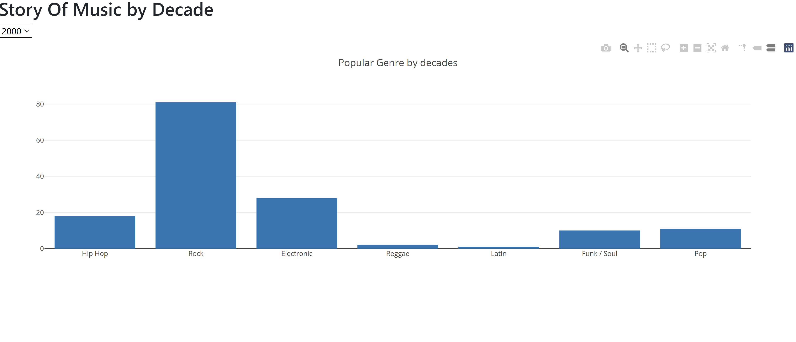

# _The Story Of Music_
__By__:     The Laughing Stones
__Members:__    Enkhsanaa, Juliana Puskar, Samson Yeung, Tamara Delice, Ali Daneshmand

 

__Project Goal:__ 

To tell the story of Music over the past 50 years.  Who was popular?  Who wasn't? 
What Genre was popular? What Genre wasn't?

__Project Presentation:__

[Google Slides Presentation](https://docs.google.com/presentation/d/10-XEvcnnNcgAOvSku44xTsCoRUQd-P7SIBwObJlaHgk/edit?usp=sharing)

__Data Sources:__ 

Kaggle:

[Spotify Tracks Dataset 1922-2021](https://www.kaggle.com/yamaerenay/spotify-tracks-dataset-19222021?select=US.csv)

[Rolling Stones Top 500 Albums of All Time](https://www.kaggle.com/notgibs/500-greatest-albums-of-all-time-rolling-stone)

__Technology Leveraged:__

	Data clean-up
		Pandas

	Database
		PostGREs / SQL

	Web page set-up and database connection
		Python Flask-powered API
		HTML/CSS
		Javascript
		Plotly
		J/Query

__Sample Visualization:__

__Process We Followed:__
1.  Data Discovery:
      A. We first downloaded all the the data we found from Kaggle and Data World related (all CSV 
        formatted)
      B. We analyzed the data to see what Columns and data sets applied to our goals.  We ultimately
          decided to limit our data to only that of the US, since using the available global data would 
          have been too much data to parse (~3.02 GB)
      C. Since our existing Data Source did not include Genre as one of the Columns in their data-
          sets, we found additional "Album" information that included Album information per artist.

2.  Data ETL Work
    A.  We first loaded and then cleaned the data in python from both Data Sources (csv based data)
         into Python Data Frames
         _* Since there were only 2 tables, the goal was to merge them into one table containing all relevant information_
    B.  Then we removed unnecessary data (unneeded columns)
    C.  We eventually discovered that the overlapping columns from both tables (pre-merging) were
          stored as different data types.  So additional data massaging was required to match data-
          types between tables in order to better facilitate the "merging" process.
    D.  Once both tables (one from each data source) was cleaned, and massaged properly, we were
         able to merge the data into one large table.
    E.  Finalized data in the final data frame was loaded into a PostGREs Data Base in preparation for
         the Flask API work.

3. Flask API & Visualization:

Data from the PostGRES Data Base was loaded into a standard FLASK API in Python to serve as the database by creating a config file.
After the database was loaded bar charts were created by utilizing plotly in the Javascript. The Javascript compares Genre each year for the last 50 years. If the information wants to be saved a screen shot button was added to snap the bar chart, along with the ability to pan around and zoom in and out of the bar chart visual.

The layout and buttons on the webpage were created by using HTML and CSS. The links on the navbar were placed so that we can add a section to display all the artists along with the songs that were in the database. CSS was used to beautify the webpage by adding backgrounds and alignments of text and images.

